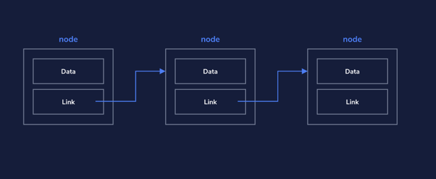
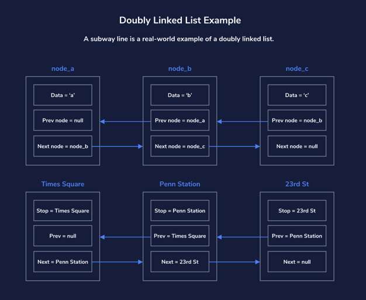

# Studying_Data_Structures
**updated Tuesday, Wednesday and Friday everyweek**

A learning note and code realization based on python including Linear Data Structures, Hash Maps, Algorithmic Concepts, Nonlinear Data Structures,
Sorting Algorithms, Graphs and Graph Traversals etc.

I will update this in detail with explanation in the next steps... 
## Linear Data Structures
### Linked lists

- Are composed of nodes(Remember that a node contains two elements: data
  and a link to the next node)
- Nodes containes a link to the previous node  (and also the previous node for bidirectional linked lists)
- Can be unidirectional or bidirectional
- Are a basic data structure, and form the basis for many other data structures
- Have a single head node, which serves as the first node in the list
- Require some maintenance in order to add or remove nodes: 
  ***Removing a node
  If you accidentally remove the single link to a node, that node’s data and any following nodes could be lost to your application, leaving you with orphaned nodes. To properly maintain the list when removing a node from the middle of a linked list, you need to be sure to adjust the link on the previous node so that it points to the following node. Depending on the language, nodes which are not referenced are removed automatically. “Removing” a node is equivalent to removing all references to the node.***
- The methods used here are an example and depend on the exact use case and/or programming language being used

### Doubly LInked lists

- Are comprised of nodes that contain links to the next and previous nodes
- Are bidirectional, meaning it can be traversed in both directions
- Have a pointer to a single head node, which serves as the first node in the list
- Have a pointer to a single tail node, which serves as the last node in the list
- Require the pointers at the head of the list to be updated after addition to or removal of the head
- Require the pointers at the tail of the list to be updated after addition to or removed of the tail
- Require the pointers of the surrounding nodes to be updated after removal from the middle of the list

**Browser history is another example(the 1st one is subway line) of a doubly linked list. When we open our browser, the page that we land on is the head of our list. As we click on things and navigate to new pages, we are moving forward and adding to the tail of our list. If we ever want to go back to something we’ve already visited, we can use the “back” button to move backward through your list**
### Searching Arrays

### Queues
### Stacks

## Hash maps
- what is Hash maps
- Hash function
- Hash map underlying data structure
- hash map only one value: Each Hash Map key can be paired with only one value. However, different keys can be paired with the same value.# Data_Structures_Review
